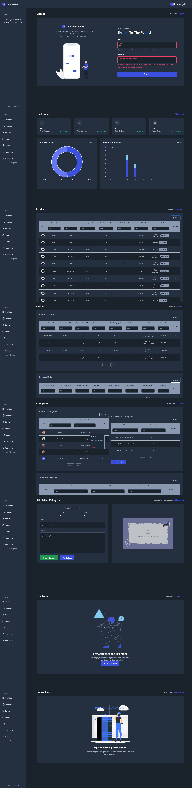

<div align="center"></div>

<h1 align="center"> Local Crafts Admin </h1>

### About Project:

#### An application designed to control and monitor local crafts' backend core features, allowing the administrator to approve products or services added by vendors and add new locations or categories.

---

### Installation

#### 1- Download local-crafts-backend

Link: <a href="https://github.com/AhmedEhab-SG/local-crafts-backend">Local Crafts Backend</a>

#### 2- Download local-crafts-admin

```bash
$ npm install

$ npm start # to run the backend

$ npm run dev # to run the admin panel in development

# Production
$ npm run build
$ npm start
```

#### [!CAUTION] You need also to add the necessary environment variables

```env
NEXT_PUBLIC_BASE_URL="the backend base url"

NEXT_PUBLIC_CLOUDINARY_CLOUD_NAME="your cloudinary name"

NEXT_PUBLIC_CLOUDINARY_SECRET="your cloudinary secret"

NEXTAUTH_SECRET="your secret"
```

---

### Made with:

» Next JS <br>
» TypeScript <br>
» Tailwind CSS <br>
» shadcn/ui <br>
» Next Auth <br>
» Redux <br>
» Axios Lib <br>
» Framer Motion <br>
» Next Cloudinary <br>
» ApexCharts <br>

<!-- Live Link: <a href="">Local Crafts Admin</a> -->

<div align="center" >

</div>
